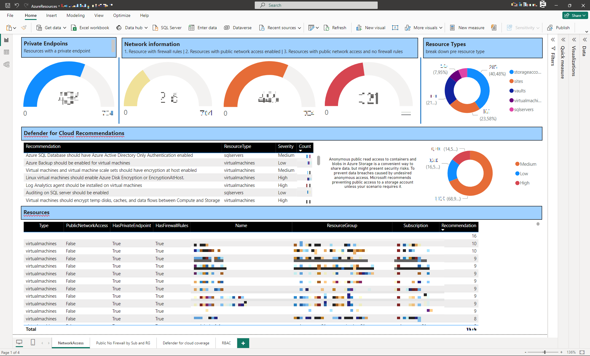

# Azure Assess Module
[](https://www.powershellgallery.com/packages/AzureAssess) 
[](https://www.powershellgallery.com/packages/AzureAssess) 
[](https://www.powershellgallery.com/packages/AzureAssess)


Welcome to the Azure Assess Module! This powerful tool is designed to enhance your Azure security assessment process. With minimal access permissions, you can gain a comprehensive understanding of your Azure resources and their security configurations. Ideal for diverse operations teams and tech-savvy management, this module is easy to use and provides valuable insights. Give it a try and see how it can transform your Azure security assessment process!

Please note that to collect the data, you'll need an account with access to the Azure resources you want to report on. Once the data is collected, you can review and share the information with others who may not have such access, such as larger operational teams or interested management personnel.

The Azure Assess Module extracts information about Azure resources at various container scopes, including Management Groups, Subscriptions, and Resource Groups. The extracted information is stored in CSV files, providing a "flattened" view of the linked resources.

In addition to resource data, the module collects information about privileged role assignments on resources at the specified scope. It also gathers information about related principals, including users, service principals, and groups, taking into account group memberships and entity ownerships.

Furthermore, the module gathers information about Defender for Cloud coverage and related recommendations.

The module comes with a PowerBI template for visualizing the collected information.

The goal of this project is to provide portable information on Azure Security. To achieve this, we've chosen to collect data via PowerShell and represent it via PowerBI. This approach ensures portability and reduces the need to provide additional access into Azure.

## Data Collection

⚠️ You'll need the following roles to execute the script:
* Permission to read the resources you want to assess: tipically the "Reader" role on the subscriptions or resource groups
* Permission to read the data on the identities you want to collect included the permission to read reports as the last signing requires it:  "Global Reader".
* Last Sign-ins to Azure are collected trough log analytics: read on the log analytics recivieng Sign-in logs, Service principal sign-in logs and managed identities sign-in logs is needed both for interactive and non interactive.

To collect data you can follow the bellow script

```powershell
# install the powershell module
PS> Install-Module -Name AzureAssess
# connect to Azure - leverages Connect-AzAccount
PS> Connect-AzureAssess
# Collect information about management groups
PS> Get-AzureAssessResources -ManagementGroupNames <management groups>
# *Or* collect information about a subscription
PS> Get-AzureAssessResources -SubscriptionId <subscription id>
# *Or* collect information about a resource group
PS> Get-AzureAssessResources -SubscriptionId <subscription id> -ResourceGroupName <resource group name>
# Get information about role assignments
PS> Resolve-AzureAssessPrivilegedIdentities
```

This will give you the set of CSV that can be loaded into PowerBI template [``./assets/AzureResources.pbit``](./assets/Azyreresources.pbit)

## Power BI Example

The image below depicts the result in Power BI:



## Information on Targeted Resources

For Azure resources, the module primarily collects the following information:

* Id: The Azure ID of the resource
* ResourceGroupId: The ID of the resource group hosting the resource
* Type: The type of the resource
* Name: The name of the resource
* Link: The link to view the resource in Azure
* Location: The location of the resource
* PublicNetworkAccess: Whether network access is enabled or disabled for the resource
* HasFirewallRules: Whether there are specific firewall rules related to the resource
* HasPrivateEndpoint: Whether there is a private endpoint associated with the resource

The resources currently supported are:

* App Service Plans
* Web Apps
* SQL Servers
* Key Vaults
* Storage Accounts
* Virtual Machines
* Private Endpoints 

### Azure App Services 

For App services, the following additional information is gathered:

* AppServiceInbound: Public if the app service plan has a public address, or Internal for private addresses

### Azure Web App

For Web apps, the following additional information is gathered:

* State: Status of the Web App (running or stopped)
* DefaultHostName: The default hostname for the webapp
* HttpsOnly: Whether TLS is mandated
* MinTlsVersion: Minimum version of TLS
* FtpsState: Whether FTP(S) is enabled and FTPS is required to upload code
* AppServiceEnvironmentInbound: Whether the leveraged app service environment, if used, is on a public IP or a private IP.

### SQL Server

For SQL servers, the following additional information is gathered:

* FullyQualifiedDomainName: The FQDN of the server
* MinimalTlsVersion: Minimum version of TLS
* AdministratorType: Type of administrator for the SQL (Active Directory or local)
* EntraOnlyAuth: Whether the SQL server only allows SQL authentication

### Key Vault

For Key Vaults, the following additional information is gathered:

* VaultUri: URI of the vault
* EnableSoftDelete: Whether soft delete is enabled
* EnablePurgeProtection: Whether purge protection is enabled

### VM

For Virtual Machines, firewall rules and public access are evaluated specifically. Public Access is considered disabled if the VM doesn't have a NIC with a public IP. Firewall Rules are evaluated against the corresponding NSG rules (disallow all incoming present and no rules allowing all). The additional information gathered includes:

* HasOpenSSHorRDP: Whether SSH (tcp 22) or RDP (tcp 3389) ports are allowed
* VmSize: Size of the VM
* PublicIp: The public IP of the VM, if present

### Private Endpoints

Private endpoints are collected to join on the above resources.

### Security Recommendations

The script also collects the Defender for Cloud recommendations in this CSV.

### Subscriptions

The list of subscriptions seen during collection.
Additional information on subscriptions includes:
* What Defender for Cloud protections are enabled on the subscriptions
* Per Defender for Cloud protections, are there any resources protected present

### Management groups

Only basic infromations on management groups are collected.

### Role Assignments

For the collected resource groups the role assignement are collected including the parent subscription and management groups and child resources.

### User, Groups and ServicePrincipals

All related Users, Groups and ServicePrincipals are collected.
Membership as well as ownerships are extended.
